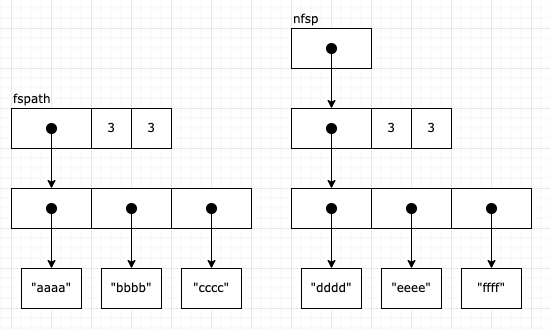
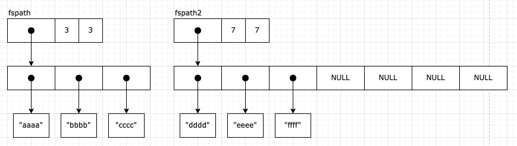
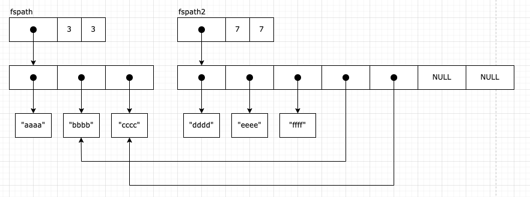
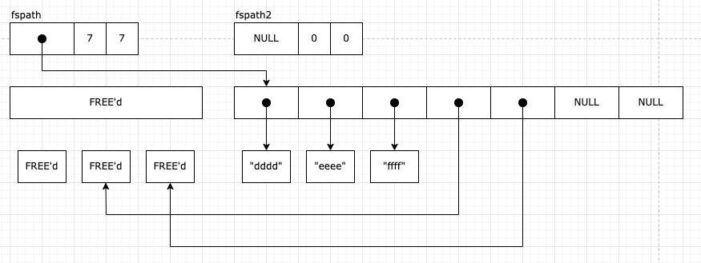

# poc4 (NFS)

This report presents a vulnerability in the NFS client of [xnu-8020.121.3][1].
This vulnerability could allow a malicious NFS server to achieve remote kernel
memory corruption on macOS with minimum user interaction. This report also
presents a simple proof-of-concept to trigger the vulnerability. The PoC has
been tested successfully on both M1 and Intel MacBook devices running macOS
Monterey 12.4.

## Description of the vulnerability

The vulnerability is located in the function [`nfs4_mount`][2] which is
responsible to set up an NFSv4 mount. The gist is that the combination of the
`bcopy` call at (1) followed by the `nfs_fs_path_replace` call at (2) can create
dangling pointers. A malicious NFS server can control the number of such
dangling pointers as well as the size of the "dangling allocations", within some
bounds. The details are described after the snippet.

```c
// Location: bsd/nfs/nfs_vfsops.c
// This snippet shows the entire function with irrelevant parts omitted.
int nfs4_mount(struct nfsmount* nmp, vfs_context_t ctx, nfsnode_t* npp)
{
    struct nfsm_chain nmreq, nmrep;
    int error = 0, numops, status, interval, isdotdot, loopcnt = 0, depth = 0;
    struct nfs_fs_path fspath, *nfsp, fspath2; // (3)
    uint32_t bitmap[NFS_ATTR_BITMAP_LEN], comp, comp2;
    fhandle_t fh, dirfh;
    struct nfs_vattr nvattr;
    u_int64_t xid;
    struct nfsreq rq, *req = &rq;
    struct nfsreq_secinfo_args si;
    struct nfs_sec sec;
    struct nfs_fs_locations nfsls;

    // ...

    for (comp = 0; comp < fspath.np_compcount;) {
        // ...

        if (error) {
            /* LOOKUP succeeded but GETATTR failed?  This could be a referral. */
            /* Try the lookup again with a getattr for fs_locations. */
            nfs_fs_locations_cleanup(&nfsls);
            error = nfs4_get_fs_locations(nmp, NULL, dirfh.fh_data, dirfh.fh_len, fspath.np_components[comp], ctx, &nfsls); // (4)

            // ...

            /* tear down the current connection */
            nfs_disconnect(nmp);

            /* replace fs locations */
            nfs_fs_locations_cleanup(&nmp->nm_locations);
            nmp->nm_locations = nfsls;
            bzero(&nfsls, sizeof(nfsls));

            /* initiate a connection using the new fs locations */
            error = nfs_mount_connect(nmp);

            // ...

            /* add new server's remote path to beginning of our path and continue */
            nfsp = &nmp->nm_locations.nl_locations[nmp->nm_locations.nl_current.nli_loc]->nl_path; // (5)
            if (nfs_fs_path_init(&fspath2, (fspath.np_compcount - comp + 1) + nfsp->np_compcount)) {
                fspath2.np_compsize = fspath2.np_compcount;
                for (comp2 = 0; comp2 < nfsp->np_compcount; comp2++) {
                    size_t slen = strlen(nfsp->np_components[comp2]);
                    fspath2.np_components[comp2] = kalloc_data(slen + 1, Z_WAITOK | Z_ZERO);
                    if (!fspath2.np_components[comp2]) {
                        // ...
                    }
                    strlcpy(fspath2.np_components[comp2], nfsp->np_components[comp2], slen + 1);
                }
                // (6)
                if ((fspath.np_compcount - comp - 1) > 0) {
                    bcopy(&fspath.np_components[comp + 1], &fspath2.np_components[nfsp->np_compcount], (fspath.np_compcount - comp - 1) * sizeof(char*)); // (1)
                }
                // (7)
                nfs_fs_path_replace(&fspath, &fspath2); // (2)
            } else {
                // ...
            }

            // ...
        }

        // ...
    }

    // ...
}
```

Note: this detailed description contains some images to help illustrate the
issue and therefore it is worthwhile to open this report in an editor that can
render markdown files with PNG images.

First, as shown in (3), the variables `fspath` and `fspath2` are of type
[`struct nfs_fs_path`][3], which has the following definition:

```c
// Location: bsd/nfs/nfsmount.h
struct nfs_fs_path {
    char** np_components; /* array of component pointers */
    uint32_t np_compcount; /* # components in path */
    uint32_t np_compsize; /* # allocated components */
};
```

The `np_components` field is a pointer to a kalloc'ed buffer containing
`np_compcount` elements. Each element is a pointer to further kalloc'ed buffers
containing null-terminated strings. Note that the malicious NFS server can fully
control these variables during the call to `nfs4_get_fs_locations` at (4). It
sends an "fs_locations" request and parses the reply with `nfs4_parsefattr`,
which builds the `struct nfs_fs_path` pointed to by `nfsp` at (5). Both the
number of `np_components` elements and the size of each null-terminated string
can be controlled with any value between 1 and 1024 (MAXPATHLEN).

In the PoC, at (5), this is how the relevant variables look like in memory:



After that, `nfs_fs_path_init` is used to build `fspath2` with a size equal to
`(fspath.np_compcount - comp + 1) + nfsp->np_compcount`. In the case of the PoC,
this is (3 - 0 + 1) + 3 = 7. However, note that pretty much all of these
variables can be controlled (up to 1024). Next, the for-loop is responsible to
make a "deep copy" of the `struct nfs_fs_path` pointed to by `nfsp` into the
first part of the `fspath2.np_components` buffer. After the for-loop, at (6),
this is how the relevant variables look like in memory:



Then, we get to the first half of the vulnerability: the dubious bcopy! This
bcopy is responsible to move some number of trailing elements of `fspath` at the
end of `fspath2`. Crucially, this is a shallow copy (i.e., only the pointers get
copied). In the PoC, the number of elements copied is
`(fspath.np_compcount - comp - 1)` = (3 - 0 - 1) = 2. Therefore, after the
bcopy, at (7), this is how the relevant variables look like in memory:



Finally, we get to the second half of the vulnerability: `nfs_fs_path_replace`.
This function is responsible to destroy the original content of `fspath`,
move the content of `fspath2` into `fspath`, and zero-out `fspath2`. In my
opinion, there's nothing wrong with this function, but the previous bcopy
breaks the contract to use it correctly by aliasing pointers. At the end, this
is how the relevant variables look like in memory with the dangling pointers:



In this case, there are 2 dangling pointers but we could have only 1 or many
more. After that, the NFS server can trigger different code paths in the NFS
client. However, I stopped my analysis here by letting the memory corruption
eventually crash the kernel for the PoC.

## How to build and run the PoC?

The PoC is written in Rust, which can be installed from [here][4].

In `src/main.rs`, update the `SERVER_IP_ADDRESS` constant with the interface you
want your malicious server to run on. Note that this doesn't have to be a local
IP address (e.g., `"10.0.0.176"`) and could be an Internet-facing IP address.

Once you've installed the Rust toolchain, you can build the PoC with:
```
cargo build --release
```

This command will build the PoC as an executable in `target/release/poc`.
Then, you can run the malicious NFS server with
```
sudo ./target/release/poc
```

This command will start two TCP servers on port 111 and 2049 (which may require
`sudo`).

Then, from the victim's macOS device, add the following line in `/etc/nfs.conf`:
```
nfs.client.mount.options = vers=4
```

The vulnerability is in the NFSv4 client implementation, which is not used by
default in Finder. A quick Google search shows that adding the line above makes
it the default version. I've seen other solutions, like entering
`nfs://vers=4,{SERVER_IP_ADDRESS}` in the "Server Address" field, but this
didn't work for me.

Finally, still from the victim's macOS device, perform the following steps:

1. In the top menu bar of Finder, click on "Go" > "Connect to Server...".
2. Enter `nfs://{SERVER_IP_ADDRESS}/aaaa/bbbb/cccc` in the "Server Address"
field, then click "Connect".
3. After a few seconds, you should get a kernel panic!

Note: in this case the path `"/aaaa/bbbb/cccc"` is used to populate the `fspath`
struct. However, this isn't strictly necessary. The NFS server could redirect
the client to a different path (i.e., updating `fspath` with controlled values
as explained above), and then perform the attack. This is just a bit less work
and makes the PoC code easier to read.

[1]: https://github.com/apple-oss-distributions/xnu/tree/xnu-8020.121.3
[2]: https://github.com/apple-oss-distributions/xnu/blob/xnu-8020.121.3/bsd/nfs/nfs_vfsops.c#L1755-L2174
[3]: https://github.com/apple-oss-distributions/xnu/blob/xnu-8020.121.3/bsd/nfs/nfsmount.h#L120-L124
[4]: https://www.rust-lang.org/tools/install
